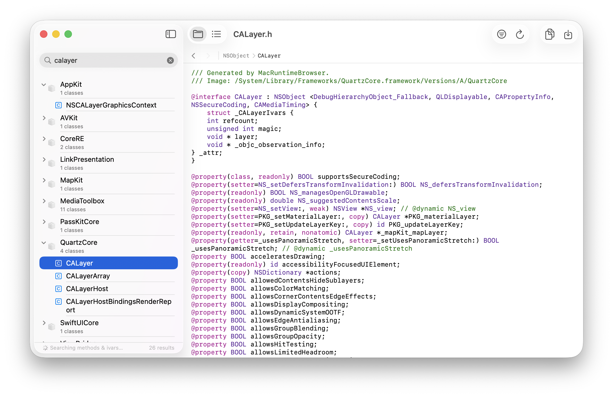

# Mac Runtime Browser

A modern macOS app for browsing the Objective-C runtime. Explore all classes and protocols loaded in your runtime, inspect their methods and properties, and generate header files, with a modern and clean macOS user interface.

## About

Mac Runtime Browser is a reimagination of the original [RuntimeBrowser](https://github.com/nst/RuntimeBrowser) project, focused on Mac. The original application, first released in April 2002 by [Ezra Epstein](https://github.com/eepstein) and maintained by [Nicolas Seriot](https://github.com/nst) since 2008, is an invaluable tool for Objective-C developers. Mac Runtime Browser brings a subset of the same powerful functionality to modern macOS with Swift and SwiftUI, featuring a complete Swift implementation, a native interface, and contemporary architecture.

## Features

- View all Objective-C classes and protocols organized by framework or as a flat list.
- Search by class/protocol name, or perform deep searches through methods, instance variables, and protocols.
- Generate complete `.h` header files with syntax highlighting, showing methods, properties, ivars, categories, and protocol conformances.
- Drag and drop frameworks, bundles, or apps to dynamically update the runtime.
- Browse inheritance chains with back / forward navigation history.
- Filter by classes only, protocols only, or view everything.

## Requirements

Mac Runtime Browser supports macOS 15.0 (Sequoia) or later.

## License

BSD 3-Clause License. See [LICENSE](LICENSE) for details.
